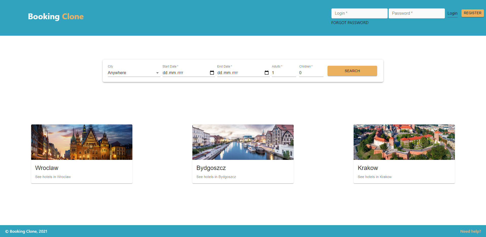
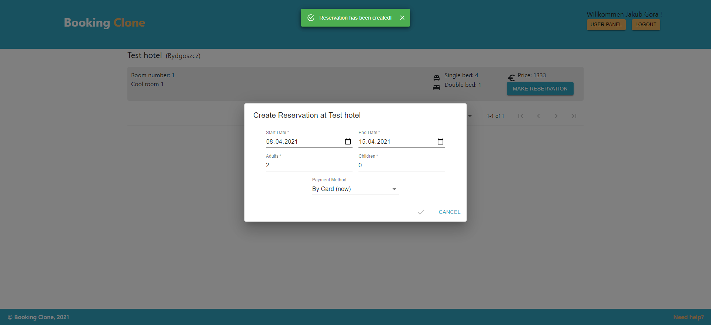
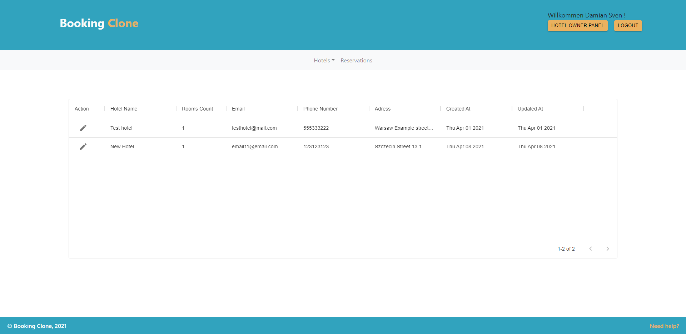
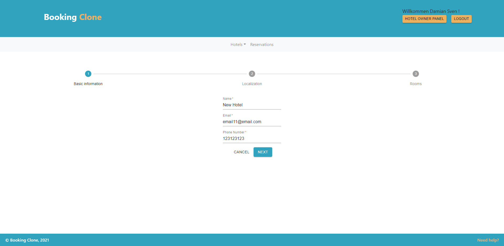
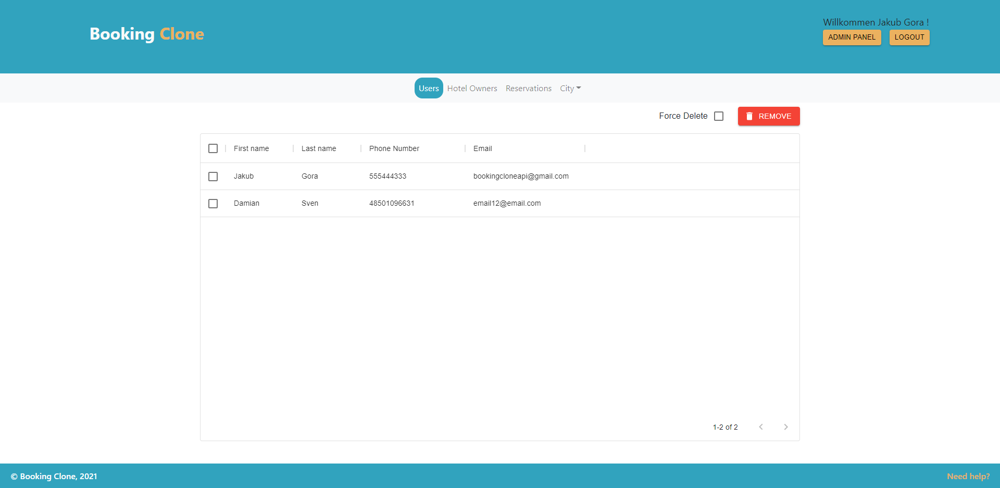

# Booking Clone Web

This is a Frontend application for [Booking Clone Api](https://github.com/pdybowski/booking-clone-Api)

Available at [Booking Clone Web](https://booking-clone.netlify.app/)

## Running the application

```bash
git clone https://github.com/pdybowski/booking-clone-Web.git
npm install #to install all the dependencies
npm start #to build and run the app on localhost
```

Also you need to have [Booking Clone Api](https://github.com/pdybowski/booking-clone-Api) installed on your operating system.
To set up api properly reffer to [this](https://github.com/pdybowski/booking-clone-Api#readme) documentation

## Home Page



## Getting hotels


## Making reservation



## Hotel Owner Panel



## Create New Hotel



## Admin Panel



## Build With

- HTML
- CSS
- React

## Tools used

- React
- React-Router
- Material UI
- Prettier
- Babel
- Webpack
- Bootstrap

## Authors

- [Piotr Dybowski](https://github.com/pdybowski)
- [Ireneusz Bednorz](https://github.com/ibednorz)
- [Szymon Kin](https://github.com/hoolek77)
- [Jakub Góra](https://github.com/GoraJakub)
